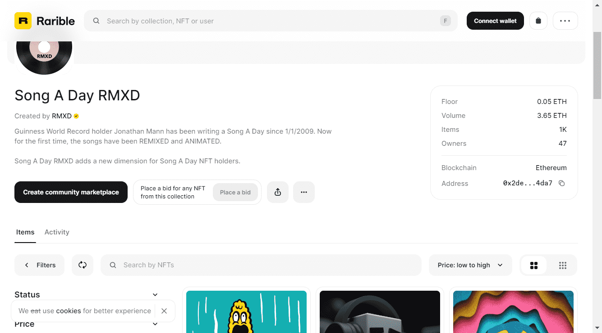

# Song A Day RMXD

吉尼斯世界纪录保持者 Jonathan Mann 自 2009 年 1 月 1 日以来一直在写一首歌曲。现在，这些歌曲第Metaplex：通过 Rarible 体验最大的 Solana NFT 生态系统
Metaplex 使 Solana NFT 看起来很简单。以下是您如何通过 Rarible 使用他们的一些工具的方法。一次被重新混合和动画化。Song A Day RMXD 为 Song A Day NFT 持有者增加了一个新维度。

描述
原曲：Song A Day #270 (Popcorn) 原所有者：0x5e130cb7f8cdcfb5a15018ee5846769703ec4478 音频混音：Eclectic Method 动画制作：Chris Piascik 
描述
原曲：Song A Day #53 (Geriatrics in Drag) 原所有者：0x0577f8d58172bebda9718277a84f0b17417e9594 音频混音：Eclectic Method 动画制作：Gözde Mutluer

