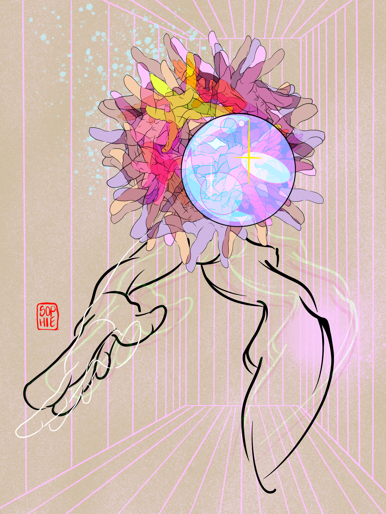

# SuperStacked Editions by Sophie Sturdevant

我的名字是索菲，出生于丹佛和芝加哥的艺术家。
在我的艺术生涯中，我开发了一种我称之为 SuperStacked 的风格。
凭借传统背景，我在物理和数字空间工作。 不管媒体如何，我的作品和过程都在“博物馆和混乱”的并列中发挥作用，利用线条和点画来讲述女性的视觉故事——就像我的作品一样，复杂、抽象和情绪激动。
樱桃溪艺术节：第一名；科罗拉多州丹佛市，1998
贝米斯艺术展；华盛顿州西雅图，2016
滴水城咖啡个展；华盛顿州西雅图 2016-2017

