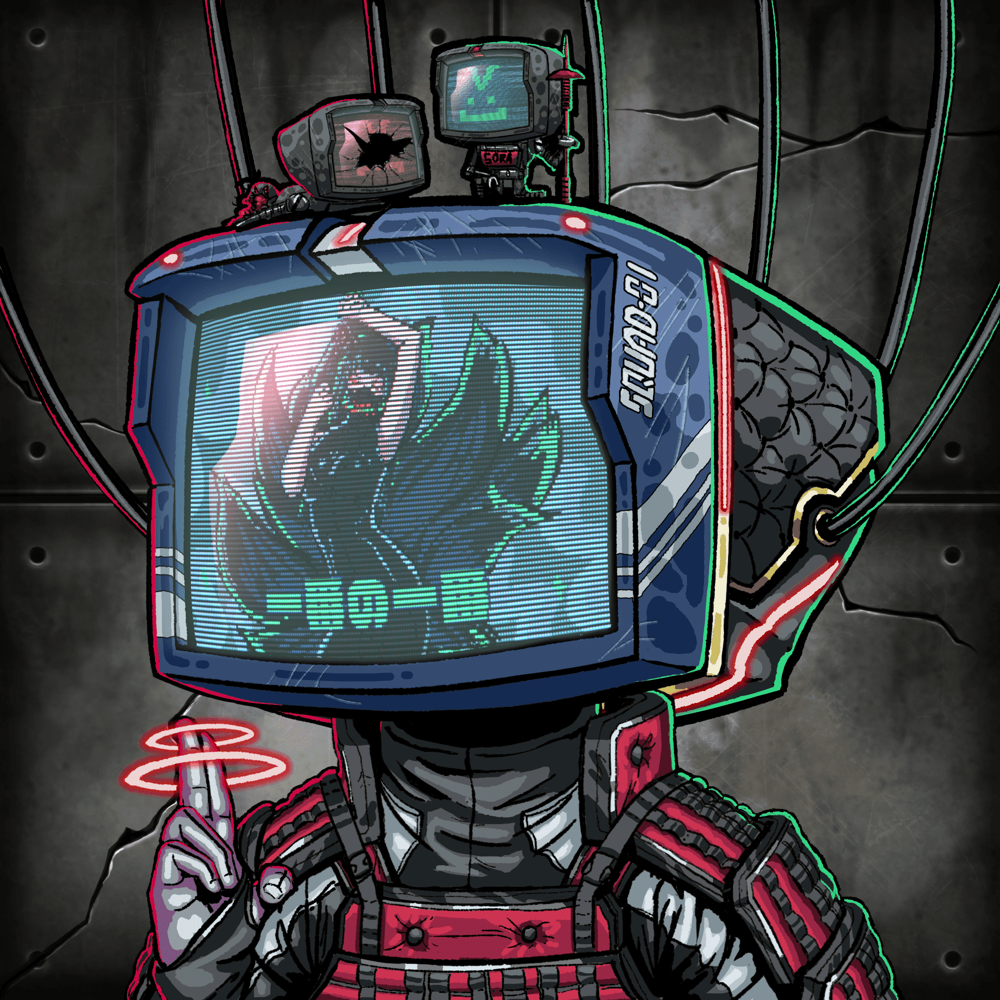

# Sora's Dreamworld: LUCID DREAMING

黑暗机器是 8888 个独特的 Gen 1 化身。
有 171 个资产与 6 个特征配对，在区块链上随机生成。排列是无穷无尽的，从而产生了按稀有程度排列的无限可能性。每一个细节都由我们才华横溢的艺术家精心绘制。

让自己沉浸在 Sora 的梦幻世界中，通过我们正在进行的沙盒元宇宙构建来解开这个超月世界的未来。铸造黑暗机器的预售

成本为0.05 ETH ，公开发售的成本为0.08 ETH。共有 6 个特征，每一个都有助于整体稀有度得分。

这些类别是：
头饰、通道、框架、外壳、身体和背景。

每个类别随机生成5个等级，从普通到传奇。我们致力于在 The Sandbox 上建立各种体验，并将对社区做出的决定和想法开放，以便在未来执行。这些想法将围绕我们 Metaverse 的进展和实用性展开。

