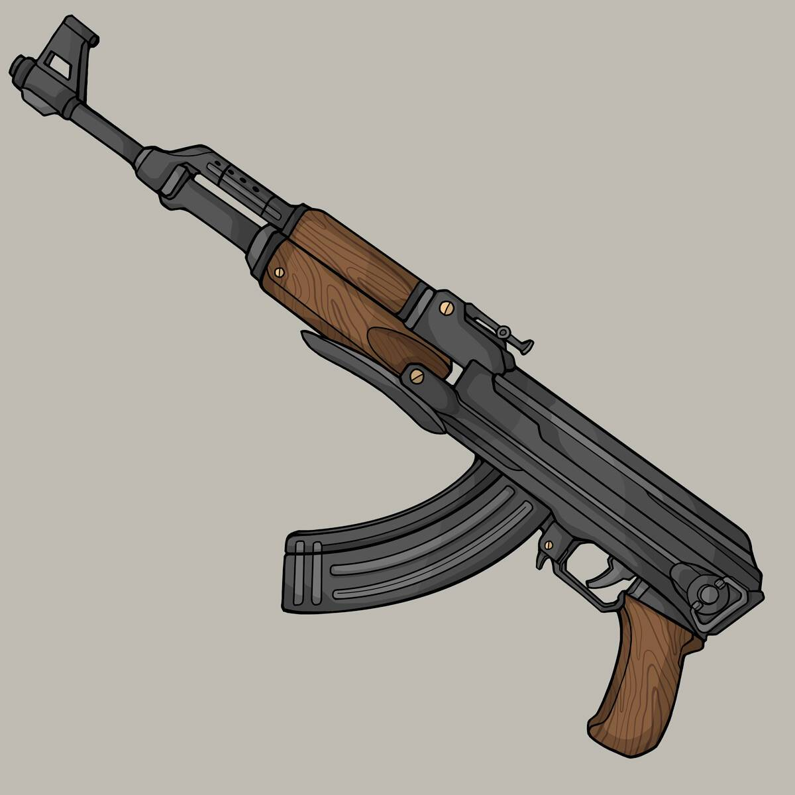

# SOS Weapons

Shark Outlaw Squad 武器可用于打开保险库并立即生成免费的 SOS Meta ID（像素）NFT，无需等待 30 天。武器只能使用1次，每次使用后都会燃烧。有关更多信息，请查看我们的 Discord。Shark Outlaw Squad (SOS)是7,777 个以犯罪为主题的鲨鱼 NFT的集合，其中包含两个对立的小队：Justice和Outlaw。

每个SOS NFT都允许您在The Vault中领取免费的Pixel 和 VX Shark（适用于 Sandbox Metaverse）。地下会合或银行破产，亡命之徒有自己的议程。

作为镇上最可怕和最残酷的流放者群体，每条鲨鱼都必须分享一个恶毒的勇气来实现相同的目标——在正义队阻止他们之前突袭 The Vault 并收集其中的神秘神器 NFT。城市的捍卫者，最重要的是避难所。Team Justice 一直是为城镇服务并确保他们控制 Outlaws 的权威阶梯的最高层。

因此，当他们听说 Outlaw 计划突袭 The Vault 时，这些维和人员准备动手保护它。

