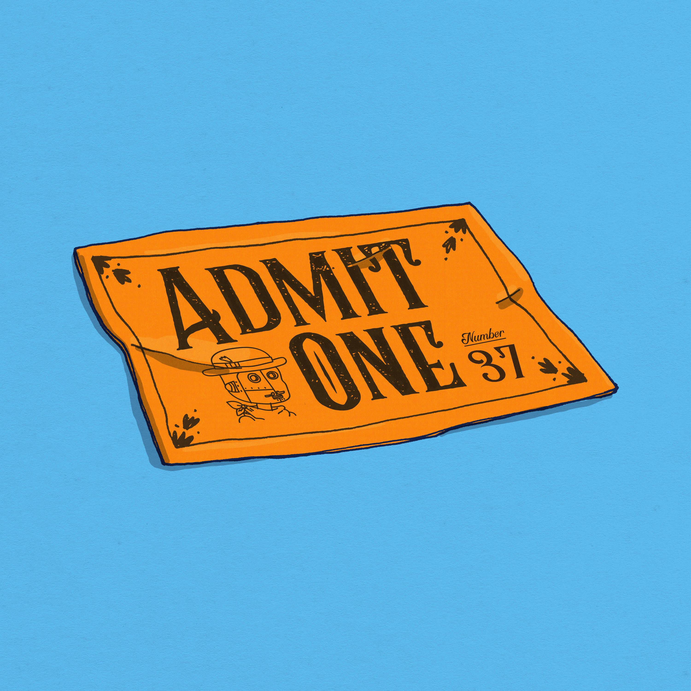

# Cabinet of Curiosities (SotH)

The Society of the Hourglass 是一个致力于包容性、好奇心和创造力的娱乐品牌！在我们的故事中，每个人都参与其中。沙漏协会代表了一个释放我们所有人内在创造力的机会。我们致力于 web3 的精神，并利用 NFT* 的力量与您，我们的社区一起构建这个 IP。

通过授予 NFT 持有者的非排他性商业权利共同拥有 IP，并本着包容合作的精神，我们正在打造世界下一个大型娱乐特许经营权。沙漏协会是在以太坊区块链上穿越时空的 8,888 个角色的集合！

作为探索和了解人类在宇宙中的角色的一种手段，该协会一直存在。

由一个名为 The Stewards 的精英团体领导，并在他们可爱的机器人助手 Nigel 的协助下，协会穿越时空，收集文物，探索新世界，并记录他们一路上学到的一切！

