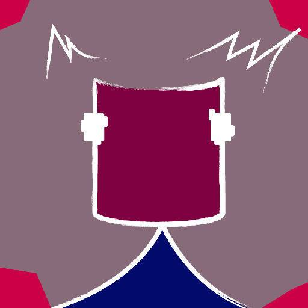

# SoulBound Genesis Layer0

魂界创世层0统计
最近7天没有售出结界源层0。

关注推特，灵魂们，所有信息都会先推特推特：https ://twitter.com/SoulBound_Soul 镜像xyz： http : //bit.ly/3MSDJzE Soulbound NFT（灵魂）诞生于免费薄荷，共6层具有不同特征，只有持有上一层的 NFT 才能释放下一层的外壳（灵魂），记住，你的铸币记录对进一步的重要。第 0 层要关闭。第 1 层来了。来自 MAKLabs 团队的 SoulBound
▶ 什么是魂界创世层0？
SoulBound Genesis Layer0 是一个 NFT（Non-fungible token）集合。存储在区块链上的数字艺术品集合。
▶ SoulBound Genesis Layer0 代币有多少？
总共有 3,566 个 SoulBound Genesis Layer0 NFT。目前，657 位所有者的钱包中至少有一个 SoulBound Genesis Layer0 NTF。
▶ 什么是最昂贵的灵魂绑定创世层0销售？
魂界创世层0 NFT最贵的是 魂界创世层0 Soul#929。它于 2022-06-10（3 个月前）以 17.9 美元的价格售出。

