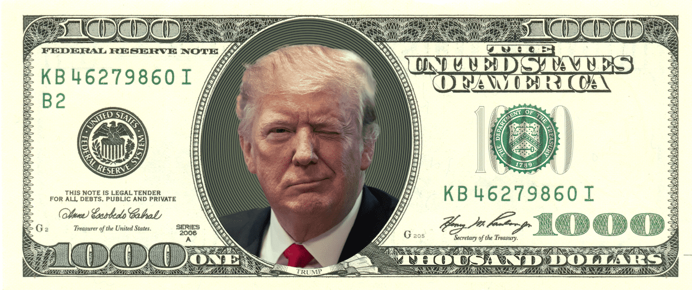

# SoundMoney

“美元是唯一足以满足日益增长的国际货币交易需求的货币，因此美国同意以每盎司黄金 35 美元的汇率将美元与黄金挂钩，并以该价格将美元兑换为黄金“2019 年，CryptoZR 创建了“1000EYE”，这是一个基于以太坊区块链的 CryptoArt 项目。 

这 1000 只眼睛中的每一个都是一个独立的 NFT，占整体工作的千分之一。红色和蓝色代表两种对立的意识形态。 你会如何选择？ 四个月后，让我们揭晓答案。 您现在可以在中出价「Red N' Blue」

