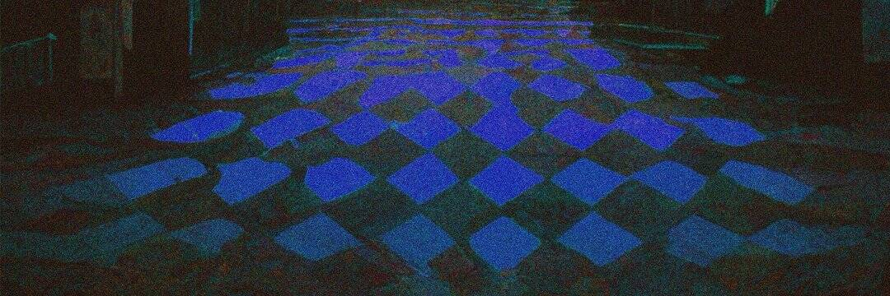

# soundsbynova

经过 
声音比新星
“错误的方式”是关于不确定。这是关于不知道你选择的路径是否正确，而是继续沿着它前进。这是关于当我有 5 种不同的感觉同时发生冲突（或类似的东西）时我得到的感觉。这就像到达山顶，却发现面前有更大的挑战。这是一种无法解释的感觉，我希望这首歌的心情能传达给人们。我希望能够在音乐上表达更多我的根源，并表达我通常想到的事情。我不擅长写我的感受，所以我希望这会有所帮助。这是拼图中的一小部分，但我希望这张照片很快就会开始显示更多的部分。最重要的是，我感谢每个人以及任何现在/将要参与其中的人。

超速赛车即将推出

嗨，我是新星
soundsbynova NFT - 常见问题（FAQ）
▶ 什么是soundsbynova？
soundsbynova 是一个 NFT（非同质代币）集合。存储在区块链上的数字艺术品集合。
▶ 存在多少个soundsbynova 代币？
总共有 25 个soundsbynova NFT。目前，22 位所有者的钱包中至少有一个soundsbynova NTF。
▶ 最近卖出了多少个soundsbynova？
在过去 30 天内售出 0 个soundsbynova NFT。

