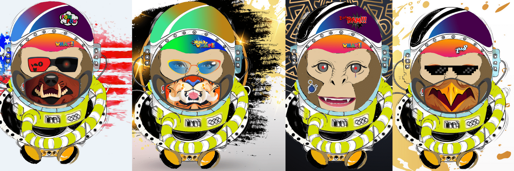

# Space AstroMonky

Space AstroMonky 统计数据
创建于 6 个月前
101代币供应
10% 费用
过去 7 天没有售出 Space AstroMonky。

space astromonky 是由 10000 个随机生成的 NFT 组成的集合，这些 NFT 由独特的特征构建而成。一些太空天文猴比其他的更稀有，但它们都在前往太空。▶ 什么是 Space AstroMonky？
Space AstroMonky 是一个 NFT（非同质代币）集合。存储在区块链上的数字艺术品集合。
▶ 有多少 Space AstroMonky 代币？
总共有 101 个 Space AstroMonky NFT。目前 5 位所有者的钱包中至少有一个 Space AstroMonky NTF。
▶ 最近卖出了多少 Space AstroMonky？
过去 30 天内共售出 0 个 Space AstroMonky NFT。

