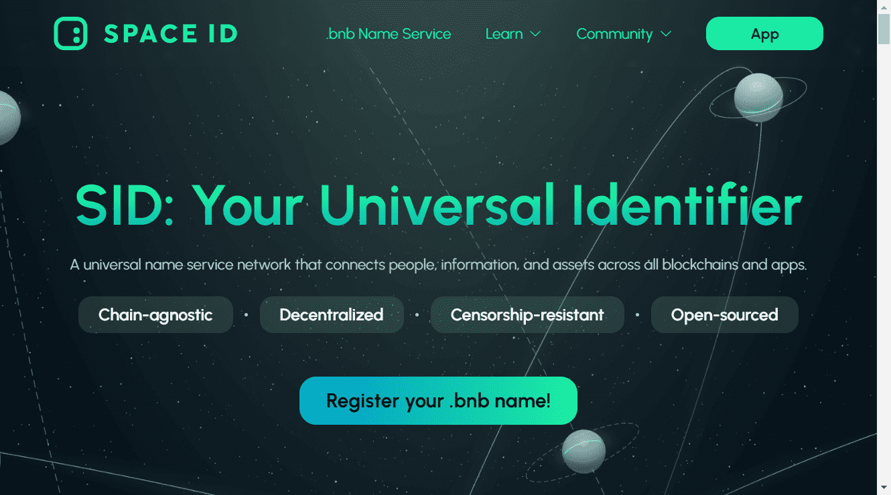

# SPACE ID Domain Name Service

太空识别
SPACE ID 建立在 BNB Chain 之上，是一个通用名称服务网络，将数字世界中的人、信息、资产和应用程序无缝连接起来。它与链无关、去中心化、抗审查和开源。

为什么要使用通用名称
社交互动是最近互联网繁荣的根本原因，这已经不是什么秘密了。人们想要身份交互，他们想要被认可：在排行榜、聊天窗口、钱包持有、NFT 列表等中显示他们的名字。他们想要与人而不是地址进行交互，以自己成为一个品牌。

