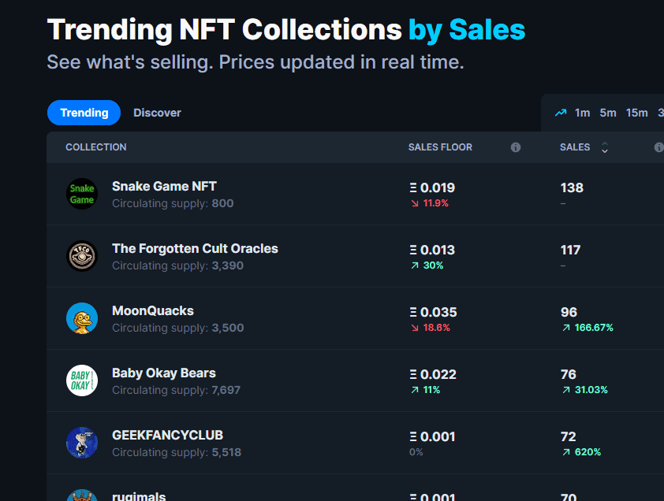

# Space Invaders Game NFT

太空侵略者游戏 NFT 统计
创建于 3 个月前
1,200 代币供应
7.5% 费用
270 名不和谐成员
过去 7 天没有售出 Space Invaders Game NFT。

Space Invaders Game NFT是 NFT 形式的互动游戏。1 Freemint / Wallet 玩并尝试直接在 OpenSea 上取得最佳成绩。1200 个项目 -> 5 个独特的
太空侵略者游戏 NFT NFT - 常见问题（FAQ）
▶ 什么是太空侵略者游戏 NFT？
Space Invaders Game NFT 是一个 NFT（Non-fungible token）集合。存储在区块链上的数字艺术品集合。
▶ Space Invaders Game NFT 代币有多少？
总共有 1,200 个 Space Invaders Game NFT NFT。目前，958 位所有者的钱包中至少有一个 Space Invaders Game NFT NTF。
▶ 最近卖出了多少 Space Invaders Game NFT？
过去 30 天内共售出 0 个 Space Invaders Game NFT NFT。
▶ 什么是流行的 Space Invaders Game NFT 替代品？
许多拥有 Space Invaders Game NFT NFT 的用户还拥有 Dystolab Crates、 666 DEGEN PIGZ、 Octo Raiders NFT和 Algorithmic By Depp。

