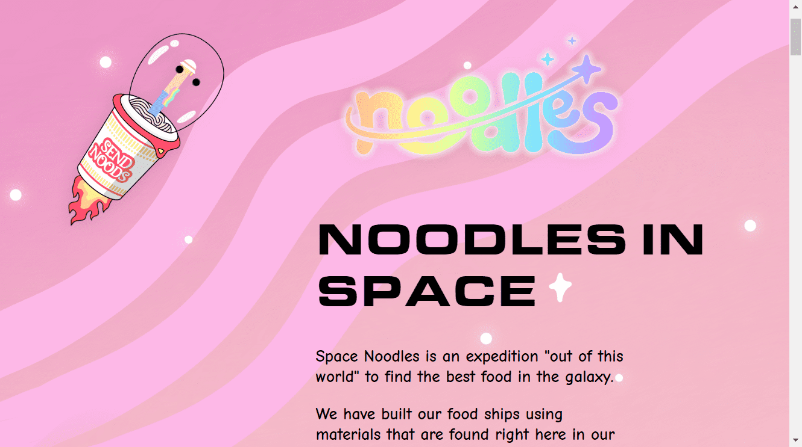

# Space Noodles

太空面条
Space Noodles 是一次“超凡脱俗”的探险，旨在寻找银河系中最好的食物。

我们使用在我们自己的面条世界中找到的材料建造了我们的食品船。

面条男孩已准备好探索银河系中最好的食物和食谱！在我们的 Noodle 朋友的帮助下，我们开始了我们的使命，又饿又想吃东西。您可以通过包裹 Noodle 来加入 Noodle Boy 来建造您自己的食物船。Space Noodles 包含超过 80 种音频和视觉特征。每个 Space Noodle 还带有随机生成的链上统计数据，可能会在未来的体验中使用。

收拾你的调味料，给引擎加油，我们要去太空。敢于冒险走出碗的面条爱好者，可以在 2022 年 3 月上旬打造属于自己的独特美食船。

