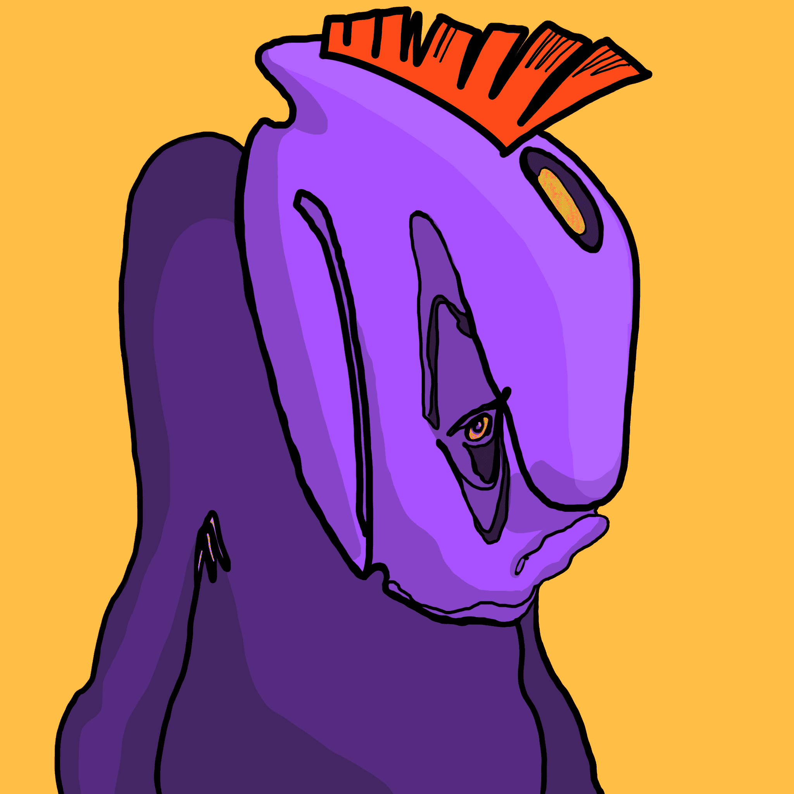

# Space Trip: Bob

Space Trip: Bob 是一个包含 5,000 个独特角色的集合，致力于满足太空探索和该行业技术发展的需求。鲍勃是来自行星 BD 1146 的独特外星种族的代表。我们这一代人出生得太早，无法乘船前往其他星球并遇到外星人。但我们能够为后代创造一切条件，为他们做这件事。每个系列都将专门用于研究深空和寻找外星生命的结构之一。此系列专用于WM 凯克天文台由Ana Feal创建.太空旅行系列的下一个系列将很快出现。 它将包含 2 个具有 SpaceX 星际飞船和火星站的绝美背景。
该系列致力于 Elon Musk 和 SpaceX 的工作

