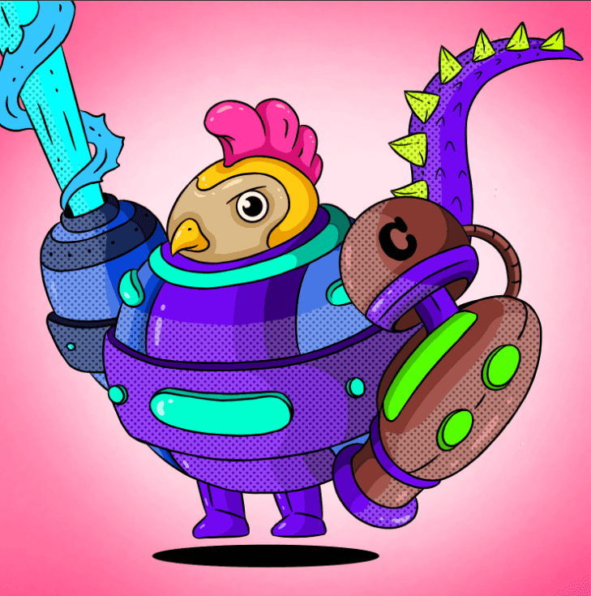

# SpaceBrawl NFT

寻找最强大战士的终极锦标赛。 SpaceBrawlers 是高度进化的动物，拥有征服宇宙的先进技术。 有超过 30 种动物可供选择，20 种不同的武器和 10 种不同的盔甲。 每个 SpaceBrawler 都是计算机生成的，并配备了不同的特征和独特的属性。 哪种动物类别最适合您在战斗中？ 现在选择权在您手中，因为终极锦标赛今天开始。

SpaceBrawlNFT - 常见问题（FAQ）
▶ 什么是SpaceBrawl？
SpaceBrawl是一个 NFT（非同质代币）集合。存储在区块链上的数字艺术品集合。
▶ 有多少SpaceBrawl代币？
总共有 103 个 SpaceBrawl NFT。目前 3 位所有者的钱包中至少有一个 SpaceBrawlNTF。
▶ 最近卖出了多少个SpaceBrawl？
过去 30 天内售出 0 个 SpaceBrawlNFT。

