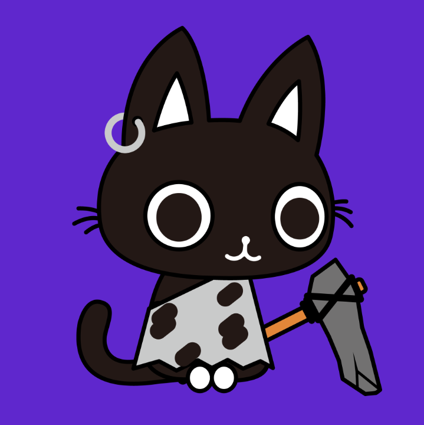

# SpaceCats Metaverse Club

SpaceCatsNFT
太空猫的设计灵感是基于“量子物理学”和物种“文明”的发展路线。 算法精挑细选的作品最终产生了10万只太空猫，每只都是独一无二的。 拥有一只太空猫，将有我们整个生态的商业价值回报。 买一只猫加入我们吧！
每个NFT我们将空投5000 SCC代币！（时间从一级市场购买开始） SpaceCat Coin（SCC）合约：（Polygon/Matic）0x3212aFa98b212d6A435009c4BF560018c43A58A2 📢1.NFT快照日期为每月10号，📢2。 发售日在每月15号左右，📢3。数量为每月1000个，分发结束5000个。

SpaceCats Metaverse Club NFT 在过去 7 天内售出 1 次。SpaceCats Metaverse Club 的总销售额为 4.21 美元。SpaceCats Metaverse Club NFT 的平均价格为 4.2 美元。SpaceCats Metaverse Club 拥有者 1,806 名，总供应量为 11,000 个代币。

