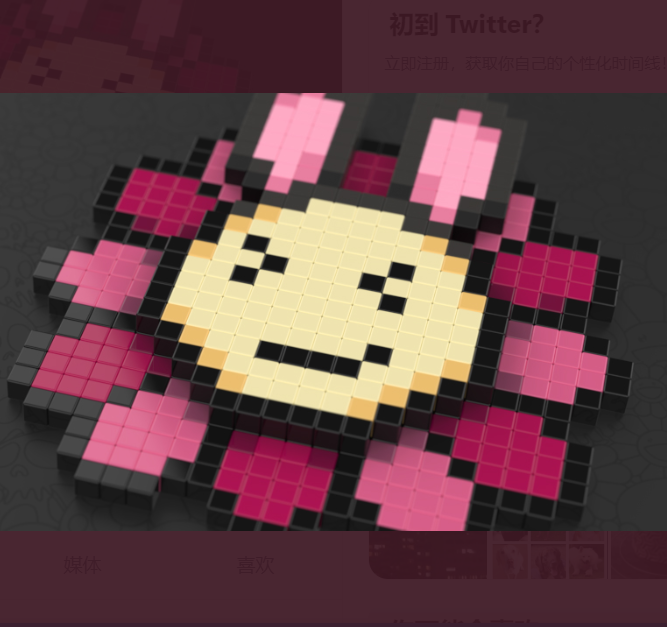

# Space Pod Stuff

过去 7 天没有售出 Space Pod Stuff。永远不会在任何至少不是 alpha 或 beta 的游戏项目上投资一毛钱。 这就是为什么我仍然没有拥有任何 Treeverse NFT，尽管我对发布感到乐观和兴奋

游戏 R:R 出局了，我等待确认好游戏

您的 RTFKT (oncyber.io) 太空舱的家居用品和家具。

Space Pod Stuff NFT - 常见问题（FAQ）
▶ 什么是太空舱材料？
Space Pod Stuff 是一个 NFT（非同质代币）集合。存储在区块链上的数字艺术品集合。
▶ 有多少 Space Pod Stuff 代币？
总共有 9 个 Space Pod Stuff NFT。目前，525 位所有者的钱包中至少有一个 Space Pod Stuff NTF。
▶ 最近卖出了多少 Space Pod Stuff？
过去 30 天内共售出 0 个 Space Pod Stuff NFT。

