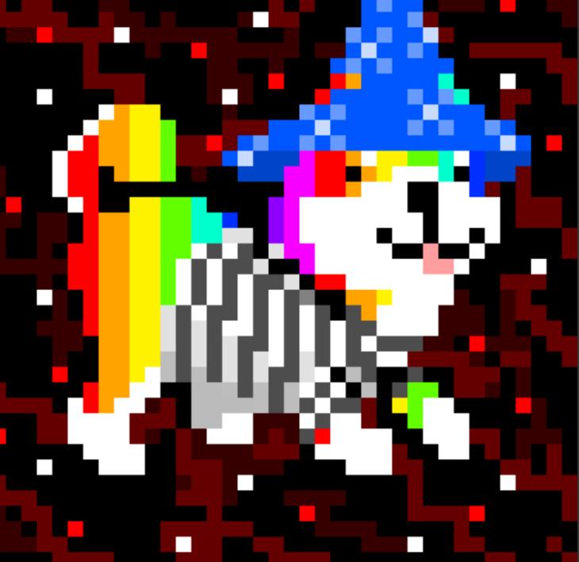

# SpaceShibas

找到你的太空柴！

10,000 名太空柴犬在浩瀚的宇宙中四处游荡，迷失了方向。使用薄荷按钮将它们带回地球！每个铸币厂都有足够的容量一次发射 10 个 Space Shibas。

SpaceShibas NFT - 常见问题（FAQ）
▶ 什么是 SpaceShibas？
SpaceShibas 是一个 NFT（不可替代令牌）集合。存储在区块链上的数字艺术品集合。
▶ 有多少 SpaceShibas 代币？
总共有 5,268 个 SpaceShibas NFT。目前，1,005 名所有者的钱包中至少有一个 SpaceShibas NTF。
▶ 最近卖出了多少台 SpaceShibas？
过去 30 天内售出了 2 个 SpaceShibas NFT。
▶ 有哪些流行的 SpaceShibas 替代品？
许多拥有 SpaceShibas NFT 的用户还拥有 The Panels-Blocks、 Kamagang、 MissCryptoClub和 Monster Blocks-Official。

