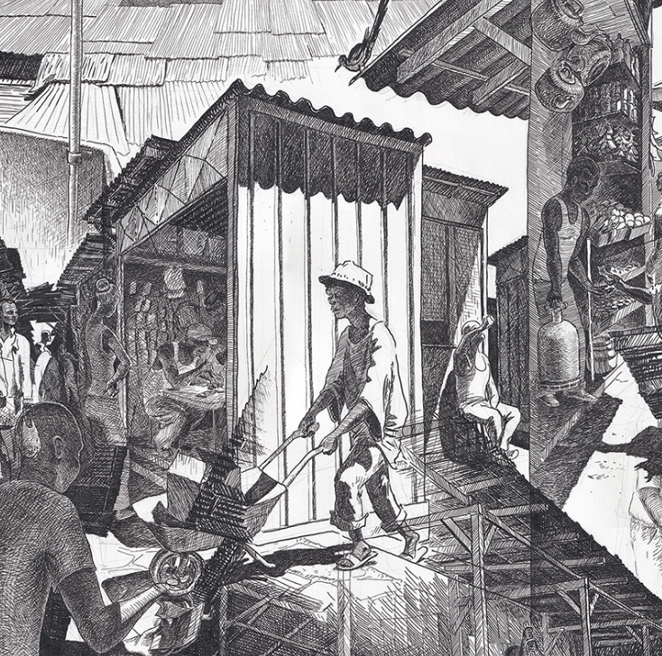

# Spatial Accretion

accretion ：名词新层或物质被缓慢添加到某物的过程”来自拉丁语 accretio(n-)，来自 accrescere '变得更大'，来自 ad- 'to' + crescere 'grow'。（牛津英语词典）每幅画专注于一个地方——无论是一个房间、一个社区还是整个城市。每幅画都是基于我对这个地方的记忆。它捕捉到了这个地方的精神，而不是这个地方本身。它揭示了突出的地方对我来说，当我体验这个地方时，让其他元素沉默。通过这种遐想，我不会像他在建筑项目中那样渲染这个地方，而是重新创建它，专注于我对它的体验并将其分解空间序列及其拓扑结构被简化为碎片，然后重新组合在一起。同一个地方的不同视角在同一张图中交织在一起，最终创造了一个新的地方：那生活在我的记忆中。

