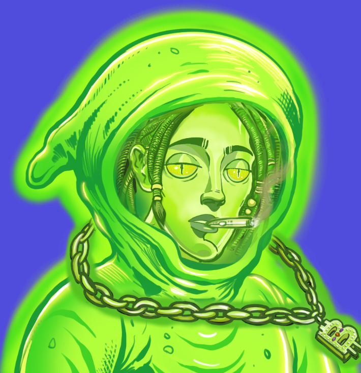

# SPC Ghosts And Elders

欢迎来到 Space Punks Club 的 Ghosts and Elders 独家收藏之家。Ghost and Elders 只能通过牺牲原始 Space Punks Club 收藏中的克隆人的生命来诞生。 该艺术由 Seagull7x 创作。欲了解更多信息，请访问：https://www.spacepunks.club/clones/1/all 过去 7 天没有 SPC Ghosts And Elders 出售。

SPC 鬼与长老 NFT - 常见问题（FAQ）
▶ 什么是SPC鬼与长老？
SPC Ghosts And Elders 是一个 NFT（Non-fungible token）集合。存储在区块链上的数字艺术品集合。
▶ SPC Ghosts And Elders 代币有多少？
总共有 1,261 个 SPC Ghosts And Elders NFT。目前 254 位车主的钱包里至少有一本 SPC Ghosts And Elders NTF。
▶ SPC Ghosts and Elders 最贵的交易是什么？
最贵的 SPC Ghosts And Elders NFT 是 Ghost #1048。它于 2022 年 6 月 19 日（2 个月前）以 46.1 美元的价格售出。
▶ 最近卖出了多少SPC鬼与长老？
过去 30 天内共售出 5 个 SPC Ghosts And Elders NFT。
▶ 什么是流行的 SPC Ghosts And Elders 替代品？
许多拥有 SPC Ghosts And Elders NFT 的用户还拥有 EL NUMEROS、 DegenOkayBears、 WaterBe4nZuki和 Old Legacy。

