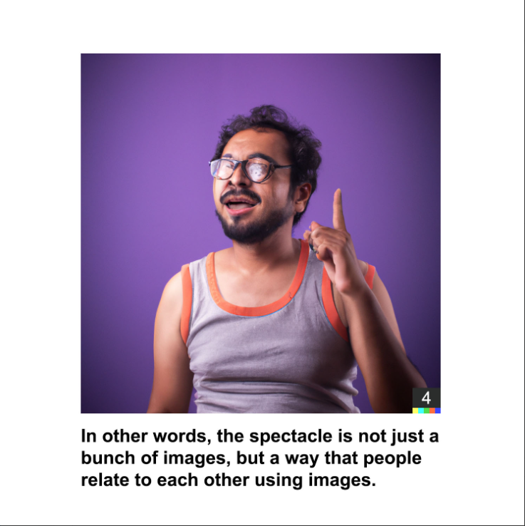

# Spectacle by Sterling Crispin

Spectacle 是对 Guy Debord 1967 年批判理论著作《The Society of the Spectacle》的重新诠释，使用 OpenAI 的 GPT3 神经网络将前十个论文简化为简单的英语，并使用 OpenAI 的 DALL-E 2 将这些格言转换为图像。 这本书是对现代生活的批判，认为我们因社会的文化、经济和政治条件而与自己、彼此以及现实本身疏远了，他称之为景观。景观通过推特大小展示了这种哲学理论 写作和生成图像。 这些图像似乎都说明了所描述的概念，但也未能掌握文本中更哲学的方面。 这导致从神经网络的潜在空间和训练它的社会中挖掘出的图像的横截面混乱。 这个半随机半自主创作的系列作品不仅仅是图像的集合，而是一种看待世界的方式。

Spectacle 通过推特大小的写作和生成图像来呈现这种哲学理论。这些图像似乎都说明了所描述的概念，但也未能掌握文本中更哲学的方面。这导致从神经网络的潜在空间和训练它的社会中挖掘出的图像的横截面混乱。正如德波所说，这个半随机、半自主的作品系列不仅仅是图像的集合，而是一种看待世界的方式，已经成为物质现实。

我的重新解释不是直接批评 OpenAI 为文化生产创造半自主技术的努力，而是一面镜子，反映了我们创造的导致这些技术的社会。GPT3 和 DALL-E 2 是大型神经网络，训练了数十亿人创作的文字和艺术品示例。它们可以产生本质上无限多种的文字和图像，这些文字和图像大多是连贯的和高质量的。这些系统在规模和能力上是独一无二的，但只是我们社会不断发展先进人工智能系统的几个例子。

