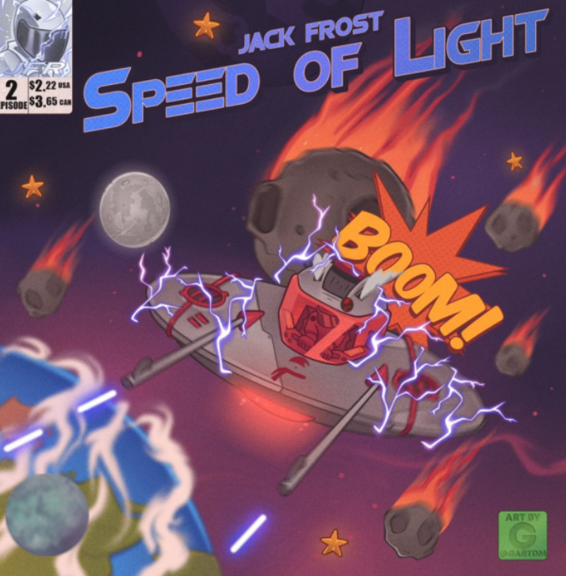

# Speed of Light by Jack Frost Episode 2

Jack Frost 的传奇：第 2 集“光速”标志着我们英雄旅程中的两个非常重要的里程碑。第一个里程碑是杰克在这个故事情节中第一次来到地球。第二个里程碑是，你第一次可以真正帮助杰克完成拯救宇宙的使命。第 2 集发现我们的英雄以光速穿越太空。

他的飞船在地球的太阳系中，就在地球轨道之外……当我们说话的时候，我们的英雄似乎离地球越来越近了！但国内的怀疑论者担心，他是不是离得太近了？在这一集中，杰克弗罗斯特外星人 DJ 发现自己正在执行地球轨道外的例行太空任务。突然，出乎意料的是，他的船被一颗小行星撞击，他被迫将他的船坠毁在最近的邻近行星地球上。当杰克的船在地球上坠毁时，他立即被美国政府拘留。

他目前被囚禁在内华达州爱德华兹空军基地的绝密偏远设施 51 区。杰克需要你的帮助才能逃离 51 区。当杰克的船被小行星撞击并开始向地球坠落时，他的设备和资源分散在全球各地。你的任务是收集这些资源并建立你的库存，这样你就可以帮助杰克逃离 51 区。

第 1 步：收集杰克·弗罗斯特传奇的第 1 章和第 2 集第 2 章：在 Twitter 上庆祝下降！访问 Twitter 并分享一篇关于这次下降的精彩帖子，并确保包含 #EscapeFromArea51 第 3 步：在 8 月 21 日星期日美国东部标准时间下午 5 点/太平洋标准时间下午 2 点访问 jackfrost.xyz 以索取您的第一个资源（必须同时包含第 1 集和第 2 集）索赔时您的钱包）第 4 步：等待进一步说明宇宙需要您。加入我们。

