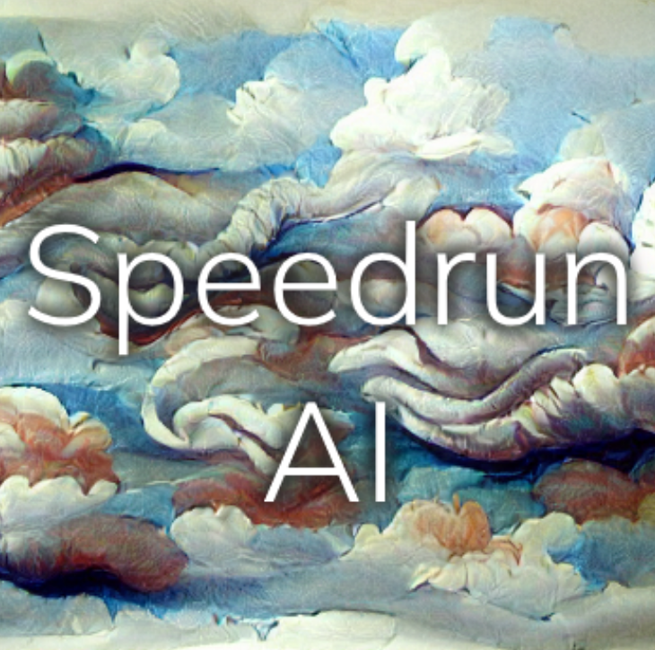

# Speedrun AI

SpeedrunAI 利用最先进的机器学习算法生成现代艺术。在被卷入更深层次之前尝试逃跑。每个限量 1/1 物品都包含您可以拥有的 The Backrooms 的不同部分！ 每个系列包含 100 件生成艺术。铸币可在 https://speedrunai.art  过去 7 天没有售出《SpeedrunAI 》。

SpeedrunAI  NFT - 常见问题（FAQ）
▶ 什么是SpeedrunAI ？
SpeedrunAI  是一个 NFT（不可替代令牌）集合。存储在区块链上的数字艺术品集合。
▶ 有多少个 SpeedrunAI  代币？
总共有 17 个 SpeedrunAI  NFT。目前 2 位所有者的钱包中至少有一个 SpeedrunAI NTF。
▶ 最近售出了多少《SpeedrunAI 》？
在过去 30 天内售出 0 个SpeedrunAI NFT。

