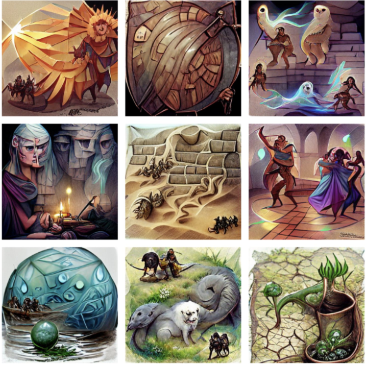

# Spells for Looters

最终包含 410 个魔法咒语的集合，其中包含由计算机想象和绘制的原始艺术品。 战利品持有者（冒险家）和公众可以铸造包含这些法术的法术书。 但是这些咒语的渲染是独一无二的。 例如，当该法术被包含在法术书中或被掠夺者使用时，可以授予拥有者特殊特权。 有时，人工智能决定签署它的创作之一。 签名是不可思议的，但令人着迷。 #loot #lootspells  铸币现在对战利品法术书开放。 每个法术书 8001-12000 0.15 ETH。
正在快速增长！

  
