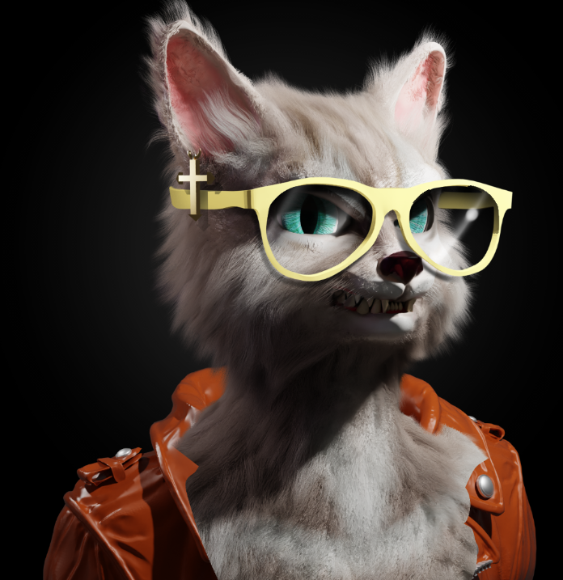

# Spin cat

薄荷是活的！ www.spincat-mint.io /0.03 ETH + gas！ （使用 ERC721/A 合约）。SPIN CAT NFT 是提供机会成为区块链上快速增长的在线彩票 VIP 俱乐部成员并从中获得被动收入的项目。 一切都将削减到 3999 NFT。

价格：0.06 ETH  Mint 5，获得 1 空投作为奖励！供应：3999 白名单1000个NFT

2999 个 NFT 用于公共铸币厂

旋猫贵宾俱乐部社区被动收入机会 

您将能够在8 月 11 日 的 Opensea
Limited Mint Date看到您的 NFT。

Spin cat NFT - 常见问题（FAQ）
▶ 什么是 Spin cat？
Spin cat 是一个 NFT（非同质代币）集合。存储在区块链上的数字艺术品集合。
▶ 有多少 Spin cat 代币？
总共有 12 个 Spin cat NFT。目前，11 位车主的钱包中至少有一个 Spin catNTF。
▶ 最近卖出了多少只 Spin cat？
在过去 30 天内售出 0 个 Spin cat NFT。

