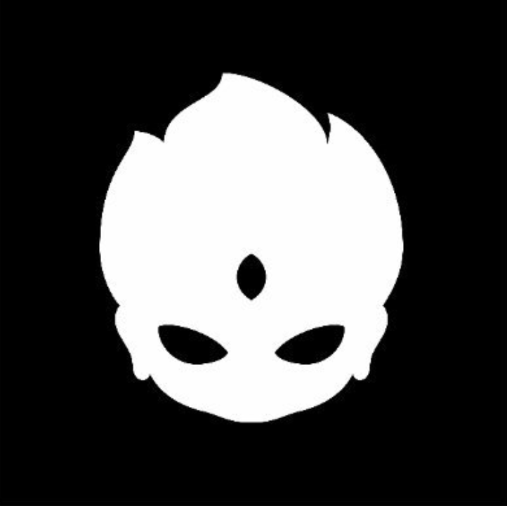

# Spirits of the Valley

在过去的 7 天里没有出售山谷之魂。

Spirits of the Valley NFT - 常见问题（FAQ）
▶ 什么是山谷之魂？
Spirits of the Valley 是一个 NFT（非同质代币）系列。存储在区块链上的数字艺术品集合。
▶ 山谷之灵代币有多少？
总共有 1,018 个 Spirits of Valley NFT。目前，208 位车主的钱包中至少有一款 Spirits of the Valley NTF。
▶ 什么是最昂贵的山谷烈酒销售？
最昂贵的 Spirits of the Valley NFT 是 #348。它于 2022 年 6 月 25 日（2 个月前）以 4.9 美元的价格售出。
▶ 最近卖出了多少《山谷之魂》？
过去 30 天内售出了 3 份 Spirits of the Valley NFT。

