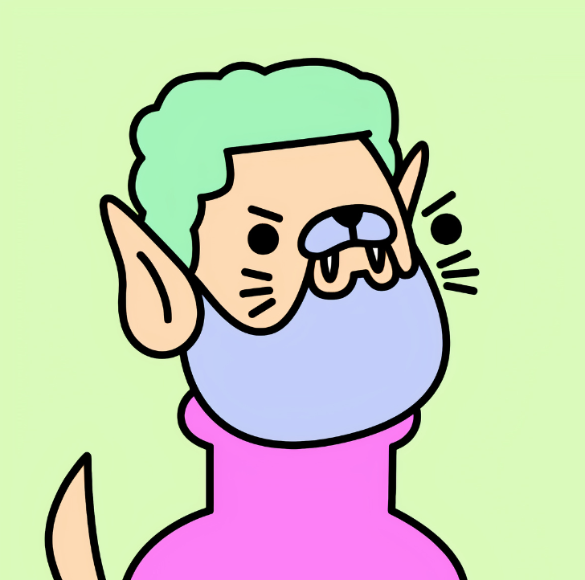

# Spookles

Spookles 是 300+1 个创世纪作品的集合，没有 A.I. 一代使用，每一件都是手绘的。 我们打算提供我们可爱的艺术，为持有者提供惊人的功能和功能将被优先考虑。 持有 Genesis 作品将为您带来我们即将推出的 V2 系列的特别优惠。 社区对我们来说就是一切。 欢迎来到 Spookles！注意：我们不隶属于 Doodles。

关于体素艺术
我们热爱我们的社区，我们希望举办真实的活动和聚会来与他们见面。但在我们能够做到这一点之前，我们带来了下一个最好的东西：元宇宙。我们在 Sandbox 中的 Spookles 土地是我们闲逛和举办链上活动的理想场所。

Lorem The Voxel Spookles 将是 Genesis 系列的 1/1 副本，对 v1 持有者免费。

关于婴儿幽灵
Baby Spookles 是 Spookles 的核心系列。凭借原创艺术和特殊互动组件，Baby Spookles 将成为您的“链上”朋友

。将有 5555 个 AI 生成的角色，具有 130 多个特征。我们保留了与 Spookles Genesis 系列相同的艺术风格：简单的线条、令人惊叹的色彩和每个 NFT 的怪异元素。最重要的细节是这些特征经过精心组合，以便在收藏中拥有最佳稀有度。

关于人工智能集成
我们对此非常乐观，迫不及待地想让你们尝试一下。用 AI 探索的机会无限 这是 NFT 领域的新事物。

在您观看视频后，我们可以添加的内容不多。您的 Spookles 将在您聊天时向您学习。交互式 NFT 将从几乎没有信息开始，会提出问题、收集数据并根据将收到的答案继续与您对话。

