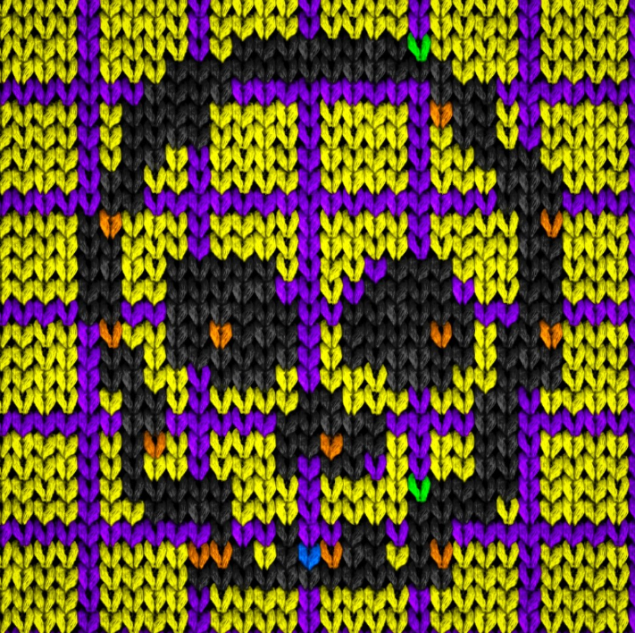

# KnitPunks Halloween Special Spooky Spools

来自 KnitPunks 工作人员的 201 件令人毛骨悚然的新针织作品！ 所有 201 个 NFT 都下跌了。 不再铸造！黑猫、骷髅、鬼魂和邪恶的南瓜。 在这里查看我们的一些朋克：快餐针织朋克我们喜欢万圣节，并想为我们的持有者做一些特别的事情。 超过 50 个被空投给我们社区的成员。 其余以合理的价格列出，供大家享用！ 安全并玩得开心！此系列中的所有 NFT 均已删除。 不再铸造。

KnitPunks NFT - 常见问题（FAQ）
▶ 什么是针织朋克？
KnitPunks 是一个 NFT（Non-fungible token）集合。存储在区块链上的数字艺术品集合。
▶ 存在多少个 KnitPunks 代币？
总共有 163 个 KnitPunks NFT。目前，149 位车主的钱包中至少有一个 KnitPunks NTF。
▶ 最近卖出了多少 KnitPunks？
过去 30 天内共售出 0 个 KnitPunks NFT。

