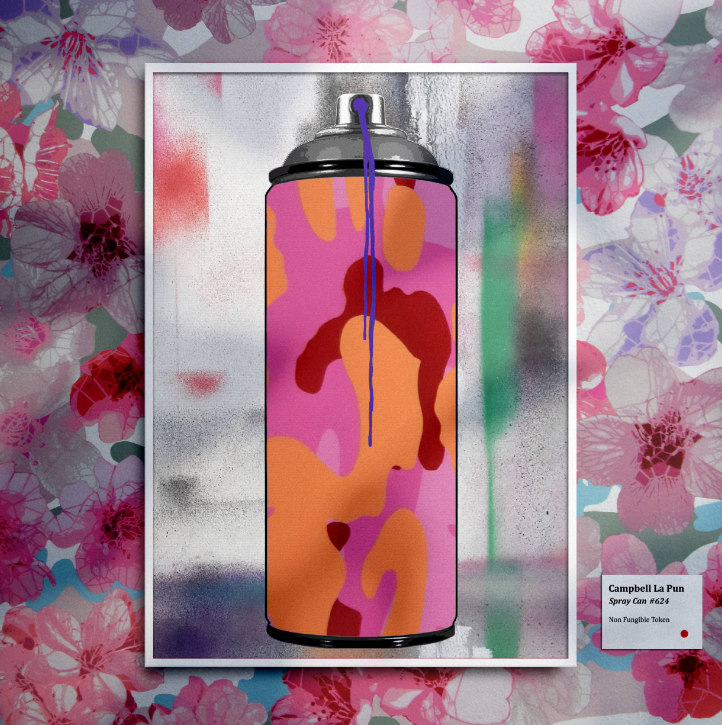

# Spray Cans by Campbell La Pun

'Spray Cans' 是由深刻的模具艺术家 Campbell La Pun 的创世纪系列。与 Museum Refined 团队 (https://twitter.com/Museum_Refined) 展出的美术合作。他流行的 Spray Can 系列已被绘制在各种媒介上，包括 帆布、木板和街道，现在在区块链上数字化。 在这个极具收藏价值的系列中，只有 1,111 个独特的喷雾罐。 ℹ️ http://spraycans.art/ 🏛️https://museum-refined.art/

喷雾罐是一个令人兴奋的工具。 你永远不能有太多的颜色。 从剧烈的一分钟摇晃到大理石的碰撞声，轻轻推开盖子，通过一个小孔释放内部积聚的压力，产生一种颜色的雾气。

 表面上是一个简单的物体，背后是复杂的工程，对历史做出了巨大贡献，标榜合法性，并标有“糖果、不明飞行物绿色和派对黄色”等名称。

 艺术家“Campbell La Pun”广受欢迎的喷雾罐系列已被绘制在各种媒介上，包括帆布、木板和街道，现在以数字方式出现在区块链上。

