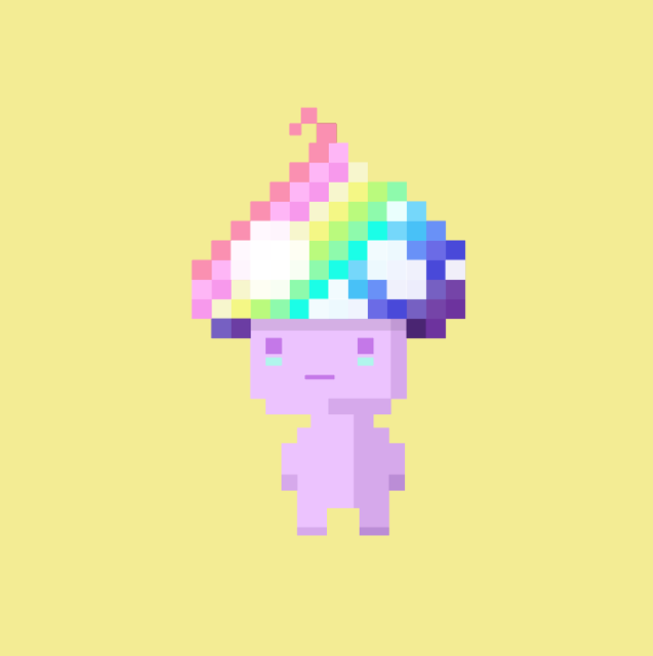

# Spritely - Genesis Collection

6,000 个可爱多彩的像素精灵。 12 种独特的类型。 6 个不同的领域。Spritely 支持儿童 + 艺术！ Spritely 团队已承诺在 Girls Who Code 和 American for the Arts 之间分配 20 ETH。Sprites 由数百个独特的神秘特征生成。 一些精灵拥有秘密的力量和需要解决的谜语。 按照线索索取无尽的宝藏！在 Spritely Arcade 中与其他 Sprites 竞争，2022 年推出三款网页游戏。街机内的游戏奖励 SHINE 代币。 不涉及质押，仅持有 Sprite 并不能保证 SHINE 积累。 SHINE 不能在 Spritely 生态系统之外购买或使用。 每个领域的精灵都有独特的实用性。网站：https://spritelynft.com Discord：https://discord.gg/spritelynft Twitter：https://twitter.com/spritelynft

