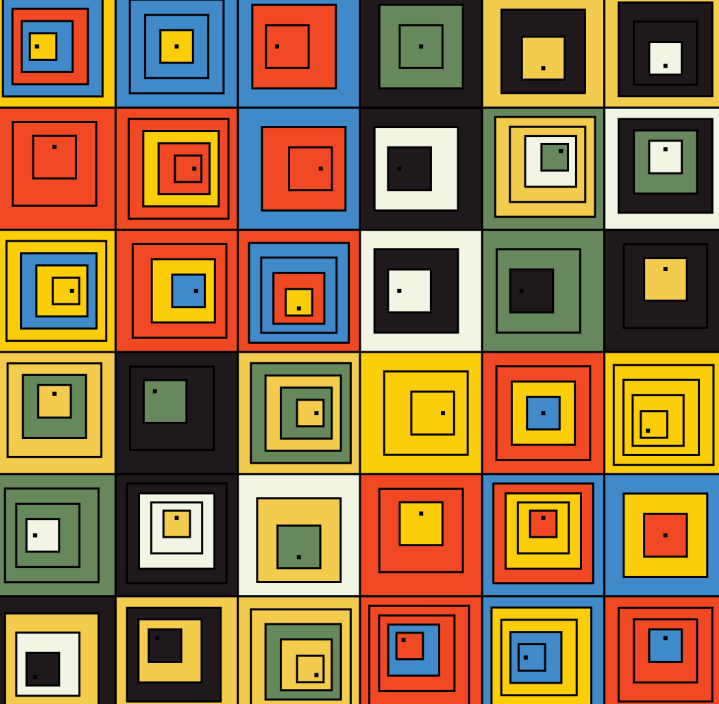

# Squareka

Squareka 是以太坊区块链上的一个生成艺术项目。4444 个以编程方式生成的 NFT。持有 4 个 Squareka？ 当他们推出时，你应该可以免费铸造一个。

过去 7 天没有售出 Squareka。

Squareka是 100% 有机和独特的。第三阶段正在进行中。在 Instagram 上关注我@baemax1st.nft

Squareka NFT - 常见问题（FAQ）
▶ 什么是 Squareka？
Squareka是一个 NFT（非同质代币）集合。存储在区块链上的数字艺术品集合。
▶ 有多少 Squareka代币？
总共有 70 个 Squareka NFT。目前 3 位所有者的钱包中至少有一个 SquarekaNTF。
▶ 最近卖出了多少个 Squareka？
过去 30 天内售出 0 个 Squareka NFT。

