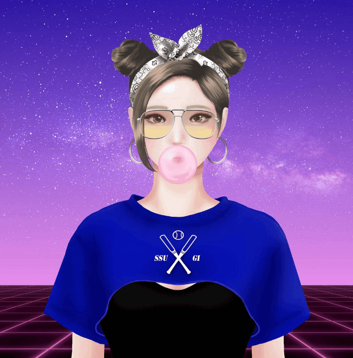

# SSUGI WORLD

HomePage(http://ssugi.world) “SSUGI”是跨元界和现实的元界虚拟人项目。 生活在元宇宙中的“SSUGI”最初作为 NFT 被介绍给世界，并开始了跨越元宇宙和现实世界的活动。 在元界，‘SSUGI’是一位喜欢运动的【摄影师】，也是一位兼职模特的【影响者】。 “SSUGI”NFT持有者将有权分享元界虚拟人“SSUGI”的活动收益。 此外，“SSUGI”NFT 将负责 Chartpan.com 和 ChartpanToken 的生态系统。

投资虚拟人“Soogi”！
Sugi NFT 作为股权担保。
以徐贤淑为模特，我们介绍了将在元宇宙和现实中工作的虚拟人“杉”。
元节“Soogi”首先作为 NFT 被引入世界，并开始了跨越元节和现实世界的活动。
在 Metaverse 中，Sugi 是一位喜欢运动的【摄影师】，也是一位兼职模特的【影响者】。
它通过 [Instagram] 与现实连接，现实世界的模型和活动收入回到 NFT 持有者。
我们计划在 Metaverse World（Earth 2、Locon 等）、Sugi World 网站和 Instagram 上以各种方式活跃。
购买 Sugi NFT 后，将有机会参加徐贤淑的线下粉丝见面会、用餐活动等。
他们也有权分享元界虚拟人 Sugi 的利润。
Sugi NFT 将负责 Chartpan.com 和 Chartpan Token 的生态系统。

