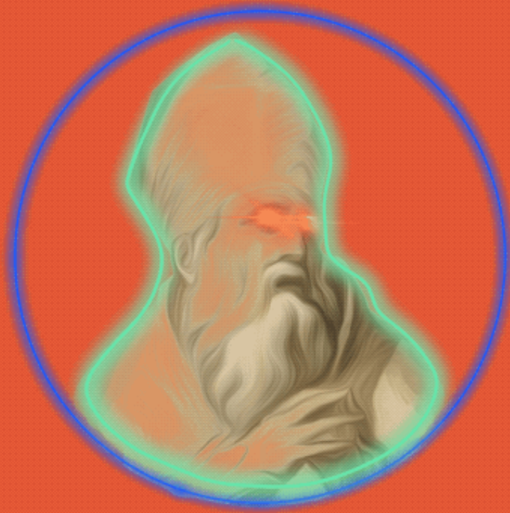

# Stamps by CRWWK

CRWWK 的 Memes + Art + HistoryStamps 是关于当今事件、图标和艺术的系列。 它是关于时刻、时代精神和我们所有人的。 欢迎来到指数时代！ 抓住你的座位，享受骑行。定制 ERC721（向 Pumpametti 的 MettiForArtists 致敬）只有 999 个将被铸造该系列是一个活生生的作品。 每周都会有新的作品掉落（直到达到 999）每件作品都带有 BTC 区块高度的时间戳（在创建时）我们的邮票由来自世界各地的数十位艺术家制作，风格从 3D、插图、动画、像素艺术、涂鸦等不一而足。首次推出包含 360 种设计。

