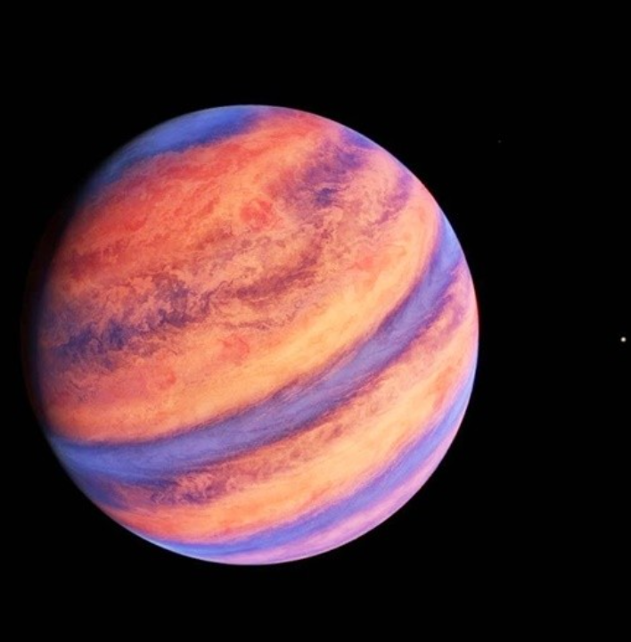

# STAR - AmZtZbawTV

目前市面上流行一种合成，燃烧1代NFT到铸造2代NFT。 我们不打算这样做。 我们要找300个'star'，燃烧1代投2代。每个燃烧1代会投10个2代NFT。

STAR - AmZtZbawTV NFT - 常见问题（FAQ）过去 7 天没有出售 STAR - AmZtZbawTV。
▶ 什么是明星 - AmZtZbawTV？
STAR - AmZtZbawTV 是一个 NFT（不可替代令牌）集合。存储在区块链上的数字艺术品集合。
▶ 有多少 STAR - AmZtZbawTV 代币？
总共有 299 个 STAR - AmZtZbawTV NFT。目前 144 位所有者的钱包中至少有一个 STAR - AmZtZbawTV NTF。
▶ 最昂贵的 STAR - AmZtZbawTV 销售是什么？
出售的最昂贵的 STAR-AmZtZbawTV NFT 是 STAR #48。它于 2022-06-17（2 个月前）以 14.8 美元的价格售出。
▶ STAR - AmZtZbawTV 最近卖出了多少台？
过去 30 天内售出了 4 个 STAR - AmZtZbawTV NFT。

