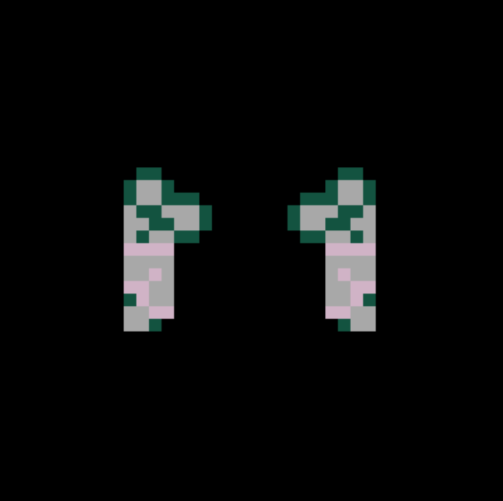

# Star Ships

Star Ship NFT 是 Pixelglyph P2E 游戏中的船只。 使用您的 Star Ship 开采 Element 69。Star Ship NFT 还包括生成的 3D Pixelglyph Invaders！ 具有生成视觉和音频的太空射击游戏。 船舶完全在链上。 有关更多信息，请访问 https://www.invaders.wtf。每个 NFT 都有独特的链上生成宇宙飞船艺术 - 飞船艺术和特征是 100% 链上的，并且使用类似于 Pixelglyphs 的元胞自动机创建。每个 NFT 是一款具有生成性的街机游戏——这是我们几个月来一直在戏弄的游戏。 它包含您的链上飞船和 Pixelglyph 的 3D 版本，并包括基于 9 种不同元胞自动机的生成音乐、故事和视觉效果。 该游戏可在 SushiSwap 上 OpenSea.Element 69 内的动画 iframe 中播放 https://analytics.sushi.com/pairs/0x4fb27613ba5d1be032edf560f99a6f5a240817f4

