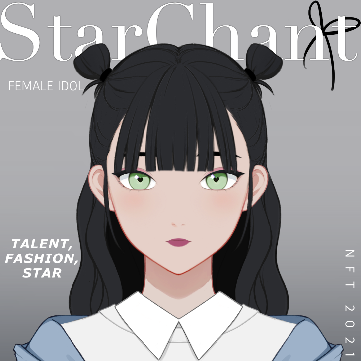

# StarChant

StarChant 是由 620 个生成化身组成的受 K-pop 启发的系列。 通过收集不同的音乐表演者，从练习生到首次亮相，再到最稀有的偶像，从而提升等级。 根据 NFT 的独特特征交易您的 NFT，以组建理想的歌手、说唱歌手和舞者群体，打造您的 K-pop 超级组合 StarChant。

说唱歌手
STARCHANT 是一款 K-POP NFT 交易游戏

铸造不同的音乐表演者来打造你的排行榜冠军超级组合 StarChant！

预售将于太平洋标准时间 10 月 11 日上午 12:01 开始

实习生受训者在娱乐机构工作室的教练培训的密集日常小组课程中开始语音和舞蹈课程。

偶像
偶像偶像们通过获得韩流和为全球最大的观众表演而达到了成功的顶峰。

首次亮相
出道首次亮相的人被分配了一个概念和组，并通过在当地的公共活动中表演，在路上一起完善他们的编舞。

