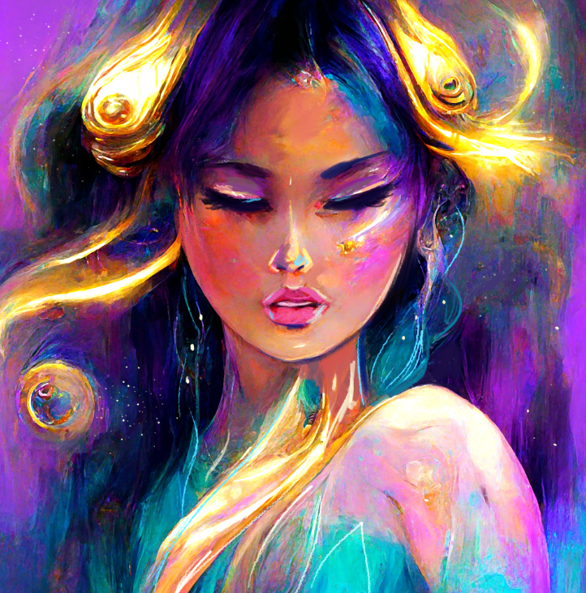

# Star Dreamers I: Mei

梅是一个梦想家，他将希望和爱的能量带入宇宙。 汲取她的魔力和内在光芒。创世纪系列包含多个季节，由 AI 生成，并在 Photoshop/Procreate 中进行轻微编辑，以获得美学吸引力并为每个梦想家的故事带来生机。10 1/1 艺术品 + 1 件在基金会拍卖中上市的最终作品。

Star Dreamers I: Mei NFTs 在过去 7 天内被售出 2 次。Star Dreamers I: Mei 的总销售额为 109.78 美元。Star Dreamers I: Mei NFT 的平均价格为 54.9 美元。Star Dreamers I: Mei 拥有者有 6 名，总共拥有 10 个代币。

Star Dreamers I: Mei NFT - 常见问题(FAQ)
▶ 什么是追梦者I：美？
Star Dreamers I: Mei 是一个 NFT（非同质代币）集合。存储在区块链上的数字艺术品集合。
▶ Star Dreamers I: Mei 代币有多少？
总共有 10 个 Star Dreamers I：Mei NFT。目前 6 位车主的钱包里至少有一个 Star Dreamers I: Mei NTF。
▶ 什么是最贵的 Star Dreamers I: Mei 特卖？
最贵的 Star Dreamers I: Mei NFT 是 Mei, Dreamer of Hope 01。它于 2022-07-03（大约 2 个月前）以 54.9 美元的价格售出。
▶ 追梦者我：美最近卖了多少？
过去 30 天内售出了 2 个 Star Dreamers I：Mei NFT。

