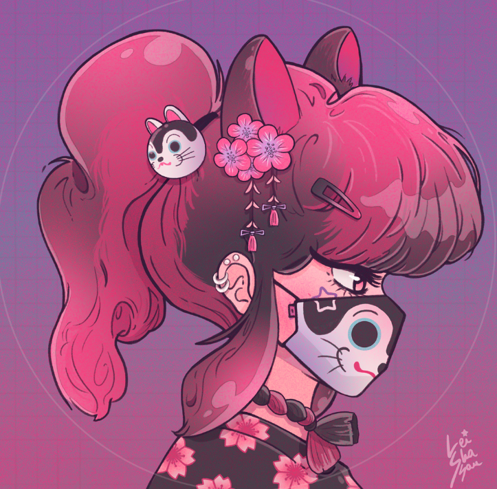

# StarFaces

✨ 来自竹下街的深处：101 个独特的手工 StarFaces NFTs.Rarity: Common / Uncommon / Rare / ★WonderFace

StarFaces NFT 在过去 7 天内售出 1 次。StarFaces 的总销售额为 140.69 美元。一份 StarFaces NFT 的平均价格为 140.7 美元。有 71 个 StarFaces 所有者，总共拥有 101 个代币。

▶ 什么是 StarFaces？
StarFaces 是一个 NFT（非同质代币）集合。存储在区块链上的数字艺术品集合。
▶ 有多少 StarFaces 代币？
总共有 101 个 StarFaces NFT。目前，71 位所有者的钱包中至少有一个 StarFaces NTF。
▶ 什么是最昂贵的 StarFaces 销售？
售出的最昂贵的 StarFaces NFT 是 StarFace #037。它于 2022-08-25（6 天前）以 140.7 美元的价格售出。
▶ 最近卖出了多少 StarFaces？
过去 30 天内售出了 1 个 StarFaces NFT。

