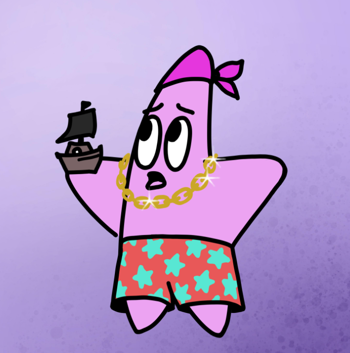

# Starfish Society

海星协会是存在于以太坊区块链上的 7,777 个随机生成的 NFT 的集合。 海星协会持有者将有机会参与独家活动，例如空投、NFT 认领、抽奖，甚至可以独家获得我们艺术家的新掉落物品。 访问 StarfishNFT.com 了解更多信息。

Baby Patrick - Starfish NFT - 常见问题（FAQ）
▶ 什么是婴儿帕特里克 - 海星？
Baby Patrick - Starfish 是一个 NFT（不可替代代币）集合。存储在区块链上的数字艺术品集合。
▶ 有多少 Baby Patrick - Starfish 代币？
总共有 85 个 Baby Patrick - Starfish NFT。目前 8 位车主的钱包中至少有一个 Baby Patrick - Starfish NTF。
▶ 最近卖出了多少 Baby Patrick - 海星？
过去 30 天内售出了 0 个 Baby Patrick - Starfish NFT。

