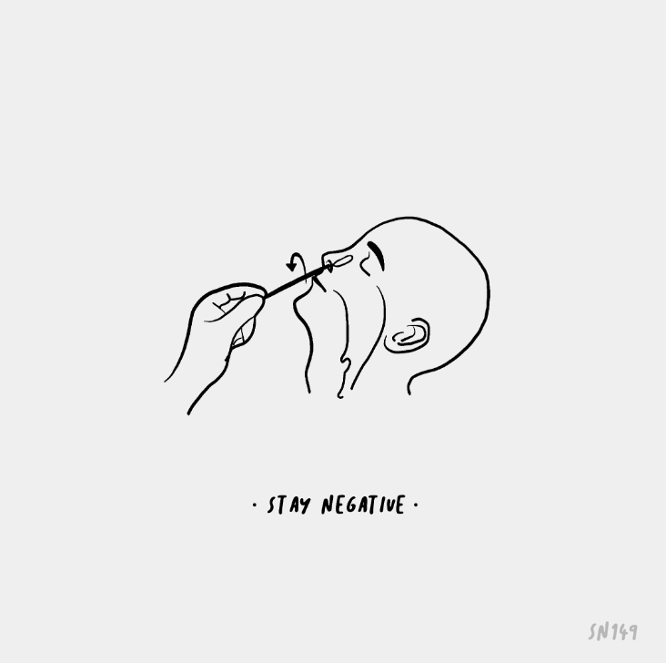

# Stay Negative

Stay Negative - 限量版 NFT 系列，热情和创造力融合在一起，创造了一系列想要带来积极和快乐的独特故事。过去 7 天内未售出任何“留负”。

保持消极 NFT - 常见问题 (FAQ)
▶ 什么是消极情绪？
Stay Negative 是一个 NFT（非同质代币）集合。存储在区块链上的数字艺术品集合。
▶ 有多少个保持负数的代币？
总共有 219 个保持负面 NFT。目前，29 位所有者的钱包中至少有一个 Stay Negative NTF。
▶ 最近卖出了多少个 Stay Negative？
过去 30 天内售出 0 个保持负数 NFT。
▶ 什么是流行的“保持消极”替代品？
许多拥有 Stay Negative NFT 的用户还拥有 Just bricks、 RiverEstate、 ACC Exclusive Drops和 David Ariew X Tatler China。

