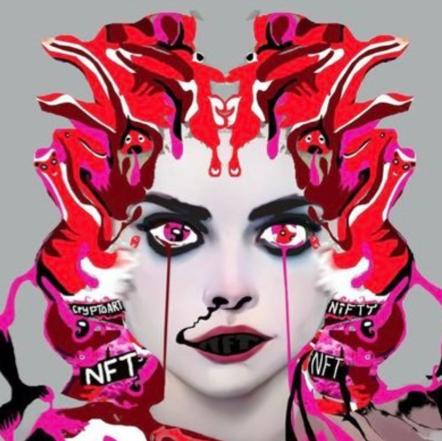

# Stellabelle Matic

欢迎来到 OpenSea 上的 Stellabelle Matic 之家。 发现这个系列中最好的项目。

NFT 世界中贪婪与平庸的致命结合催生了 CryptoStellas，这是由杰出的 OG 密码艺术家 Stellabelle 于 2021 年推出的 alpha PFP 项目。每个 CryptoStella 都是手绘的，并且永远只有 777 个。拥有 CryptoStella 即刻让您进入一个由崇高灵魂组成的专属俱乐部。所有艺术作品都备份在永久网络 Arweave 上。CryptoStellas 是一个 CC0 公共领域 NFT 项目。

Stellabelle Matic NFT - 常见问题（FAQ）
▶ 什么是 Stellabelle Matic？
Stellabelle Matic 是一个 NFT（不可替代代币）集合。存储在区块链上的数字艺术品集合。
▶ 存在多少个 Stellabelle Matic 代币？
总共有 78 个 Stellabelle Matic NFT。目前，433 位所有者的钱包中至少有一个 Stellabelle Matic NTF。
▶ Stellabelle Matic 最近卖出了多少？
过去 30 天内售出 0 个 Stellabelle Matic NFT。

