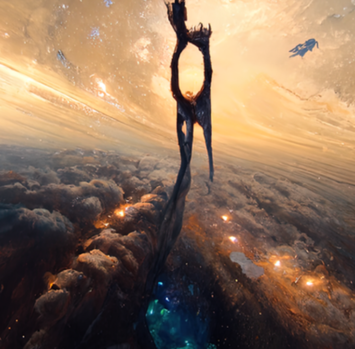

# StellarAi Gen1 part 2

GEN1 Stellar AI 收集的 420 个 nfts 的第二部分，我们是这个宇宙的一部分；我们在这个宇宙中，但也许比这两个事实更重要的是，宇宙就在我们之中。”通过提供关键字和主题，可以生成您自己的 Nfts。

海龟和野兔是一个基于社区的项目，有 797 个供应，通过持有可以访问 TurtleDAO。
‍龟可能赢了比赛，但兔子还是来了，她很生气，真的很生气。一场史诗般的战斗即将上演，比赛规则不再，竞争即暴力。野兔将被空投给海龟持有者，只有一只会存活，谁死了可以用$shell复活

