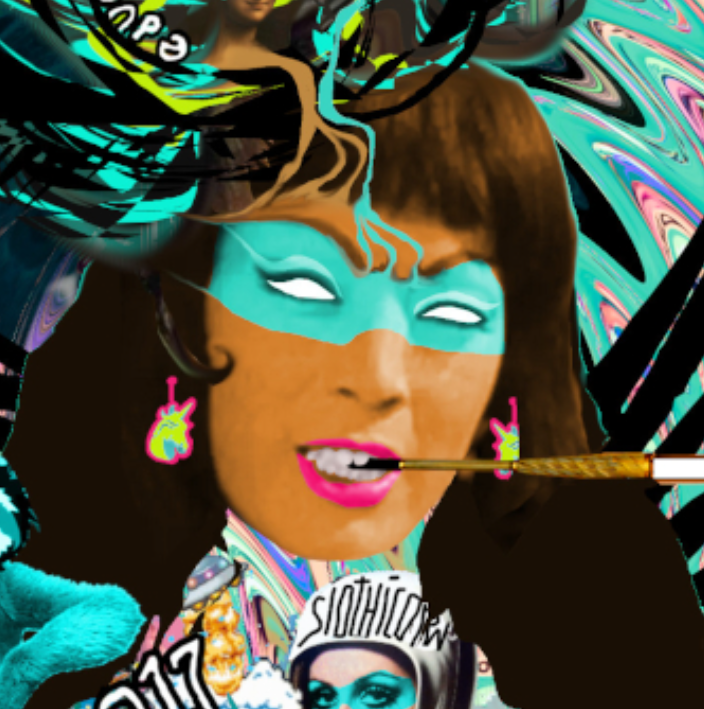

# Stellas Community

这是一个社区可穿戴设备系列，这意味着任何人都可以在获得我的批准后铸造自己的加密体素可穿戴设备。 提交您的 vox 文件（必须为 32 x 32 x 32）后，请在 Twitter 上给我发送 DM，以便我批准您的文件并制作它。 通过在此系列中铸造，您同意在您的商品出售时发送给我的 5% 折扣。 这是为了支付铸币费和我的时间。

NFT 世界中贪婪与平庸的致命结合催生了 CryptoStellas，这是由杰出的 OG 密码艺术家 Stellabelle 于 2021 年推出的 alpha PFP 项目。每个 CryptoStella 都是手绘的，并且永远只有 777 个。拥有 CryptoStella 即刻让您进入一个由崇高灵魂组成的专属俱乐部。所有艺术作品都备份在永久网络 Arweave 上。CryptoStellas 是一个 CC0 公共领域 NFT 项目。

