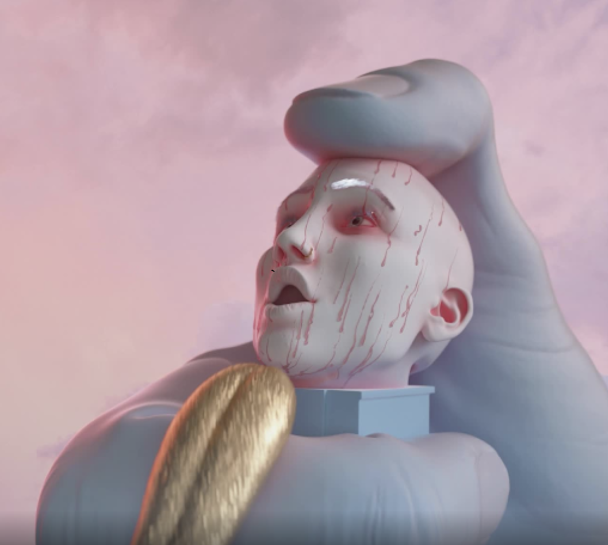

# Steven Baltay

**史蒂文巴尔泰数据**

创建于大约 2 年前，1,123 代币供应，10% 费用

过去 7 天没有卖出任何 Steven Baltay。

Steven Baltay 是纽约布鲁克林的 3D 艺术家和动画师。他的作品围绕着有机形式的超现实表现展开，这些表现唤起惊喜、厌恶和满足感。他曾与多个知名艺术家和品牌合作，包括 Adobe、Beck、Bershka、Converse、Herno、Volvox Labs (Netflix) 和 Rose Pil

Steven Baltay NFT - 常见问题（FAQ）

▶ 什么是史蒂文巴尔泰？

Steven Baltay 是一个 NFT（非同质代币）集合。存储在区块链上的数字艺术品集合。

▶ 有多少个 Steven Baltay 代币？

总共有 1,123 个 Steven Baltay NFT。目前，148 位车主的钱包里至少有一个 Steven Baltay NTF。

▶ 最近卖出了多少 Steven Baltay？

过去 30 天内售出了 0 个 Steven Baltay NFT。

