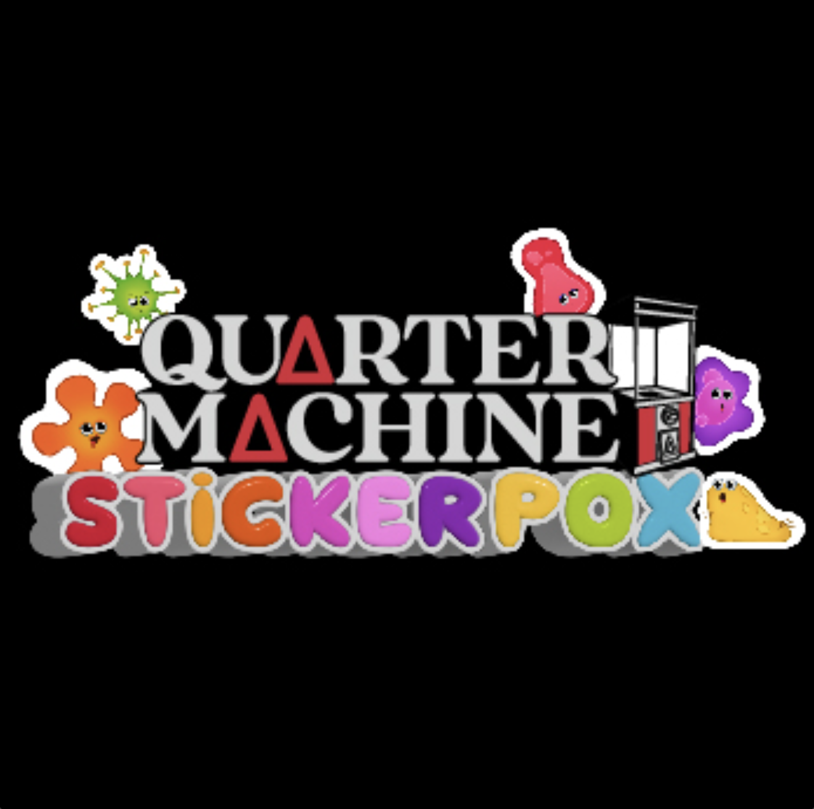

# Quarter Machine STiCKER POX

**季度机器贴纸痘统计**
创建于 9 月前，25代币供应，7.5% 费用
美工机 S 7 机 POX Ti N 出 2 次 CK 机 S 机 S 7 台 POX Ti N 的美元价格为 2 。拥有25个代币。

NFT 包含了 25 件独特的 3D 艺术作品，我们在 Spacestation 动画中看到了《ST ER POX》的角色和道具。所有作品和服装都来自艺术。

Quarter Machine STiCKER POX NFT - 常见问题（FAQ）
▶ 什么是 Quarter Machine STiCKER POX？
Quarter Machine STiCKER POX 是一个 NFT（替代令牌）集合。存储在区块链上的数字收藏品集合。
▶ 有多少 Quarter Machine STiCKER POX 代币？
季度机器有 25 个 OX 机，目前 16 个 NTiCKER 的钱包中至少有一个。
▶ 最贵的 Quarter Machine STiCKER POX 促销是什么？
最贵的 Quarter Machine STiCKER POX NFT 是 QMSP#18。它于 2022 年 6 月 29 日（2 个月前）以 220 美元的价格售出。
▶最近一次CK了多少 四分之一机 STiOX？
过去 30 个 N 出售 STiFT 4 个 Quarter Machine POX。

