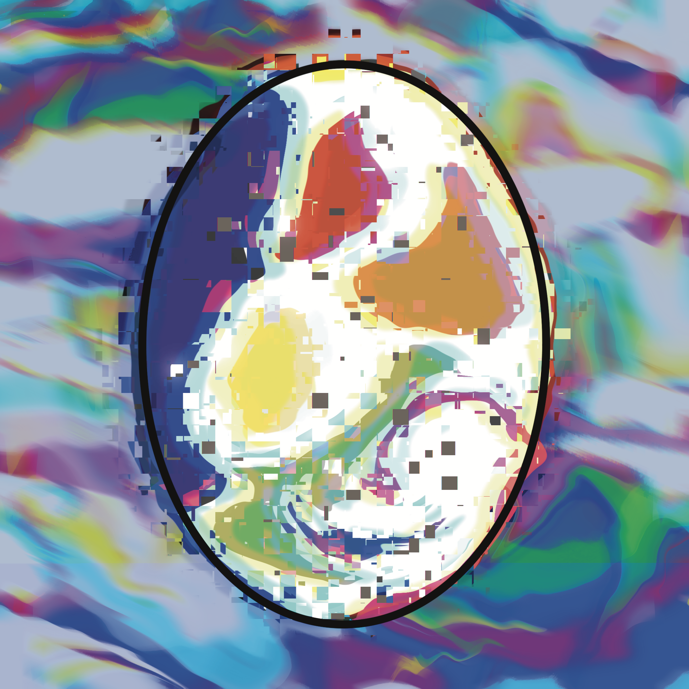

# Stoned Chicks

**扔石头的小鸡统计**

创建于 11 个月前，4,228 代币供应，10% 费用

过去 7 天没有售出被扔石头的小鸡。

一种叫做 LOUD 的神秘物质影响了当地的农场。当这种物质进入水流时，Merry Wansa 的居民将永远改变。首先受到影响的是鸡，它们的蛋是特殊的。一角钱刚刚有了新的含义。第 1 轮：6,969 中的 4,200 显示。第 2 轮：6,969 中的 2,769 即将推出 总计：6,969

Stoned Chicks NFT - 常见问题（FAQ）

▶ 什么是扔石头的小鸡？

Stoned Chicks 是一个 NFT（非同质代币）集合。存储在区块链上的数字艺术品集合。

▶ 有多少个 Stoned Chicks 代币？

总共有 4,228 个 Stoned Chicks NFT。目前，53 位业主的钱包中至少有一个 Stoned Chicks NTF。

▶ 最近卖出了多少个被扔石头的小鸡？

过去 30 天内售出了 0 个 Stoned Chicks NFT。

