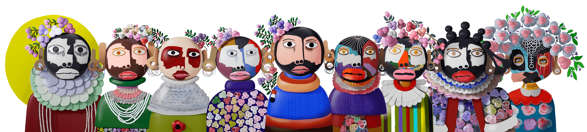

# Strangers by Kojo Marfo Official Presale NFT

“我的艺术不是制作与真人相似的艺术品，而是专注于我的梦想和童年记忆中的人物，以便我可以创造脱离现实的人物。我以这种方式工作，不仅是为了尊重我童年的视觉记忆这植根于阿寒文化形象，也是因为我希望在陌生人身上探索的主题更容易被观众理解。”“我的艺术不是制作与真人相似的艺术品，而是专注于我的梦想和童年记忆中的人物，以便我可以创造脱离现实的人物。我以这种方式工作，不仅是为了尊重我童年的视觉记忆这植根于阿寒文化形象，也是因为我希望在陌生人身上探索的主题更容易被观众理解。”

