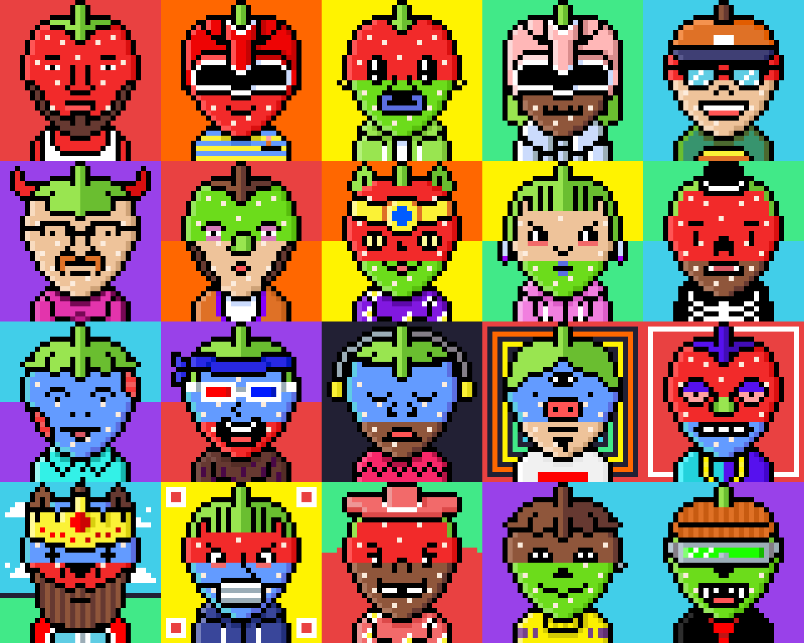

# STRAWBERRY.WTF

Strawberry.wtf 是 10,000 个独特的突变草莓 NFT。传说，每 420 年，草莓月亮就会升起，在以太坊区块链上召唤可验证的独特草莓憎恶！

那不是全部！这些草莓可以访问 Strawberry.wtf 复古像素游戏！草莓 NFT 是 10,000 种从未要求以这种方式出生的可憎之物。它们以 3072x3072 的生成艺术作品的形式存在；每个 NFT 都是以太坊区块链上唯一的[ERC-721 代]币。
‍ 没有
两个草莓是相同的，事实上，它们是[可验证的不同并且具有一堆随机属性。共有8个不同的世代点，超过20种风格！从成熟的果肉到美味的 snozberry，令人垂涎的配饰和奇怪的东西；几乎有无限可能的草莓！‍ 一次
最多[CC 许可]的！

