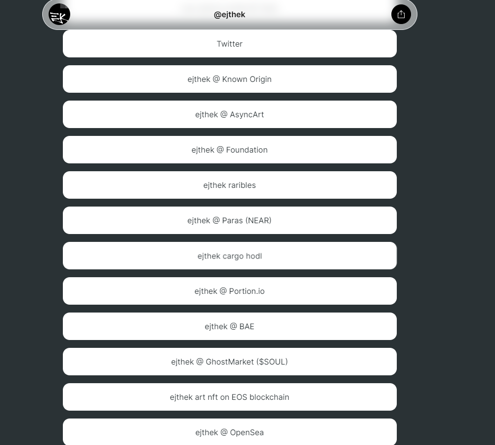

# striatis

抽象中的条纹层>> ejthek 的一项研究。777 个独特的部分作为 ERC721 代币。在推特@ejthek_art 上与艺术家联系。striatis NFT 在过去 7 天内售出 1 次。striatis 的总销售额为 5.49 美元。一个 striatis NFT 的平均价格为 5.5 美元。共有 280 名 striatis 所有者，总供应量为 777 个代币。striatis NFT - 常见问题（FAQ）

▶ 什么是纹状体？

striatis 是一个 NFT（不可替代令牌）集合。存储在区块链上的数字艺术品集合。

▶ 有多少个连续代币？

总共有 777 个 striatis NFT。目前，280 位车主的钱包中至少有一个纹状体 NTF。

▶ 最昂贵的纹状体销售是什么？

出售的最昂贵的 striatis NFT 是 [striatis #595](https://www.nft-stats.com/asset/0x7af0a49d94ca759a1bb2596b6ce7e1d017266668/594)。它于 2022-06-06（3 个月前）以 36.3 美元的价格售出。

▶ 最近卖出了多少条纹？

过去 30 天内售出了 5 个 striatis NFT。

