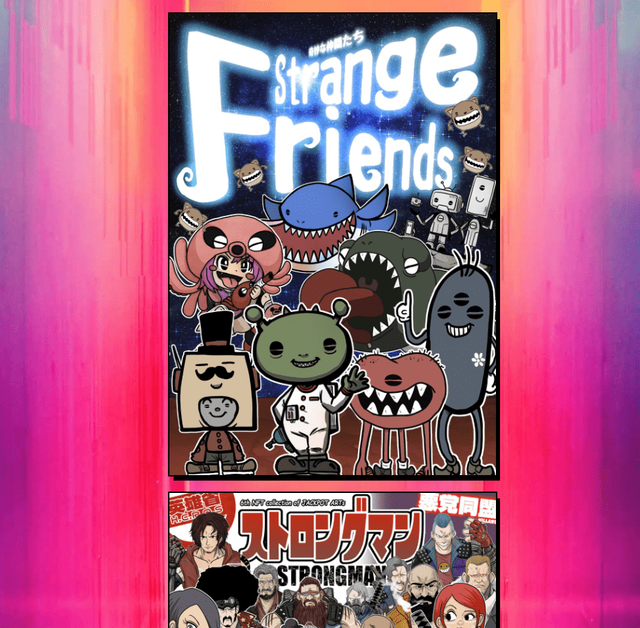

# strongmin

 剧情简介 2100 年，富豪们通过先进的科学技术获得了长生不老的力量。旧器官是从器官农场的猪身上移植出来的，并用类似塑料的加固外骨骼代替。

世界由一位名叫“强人”的英雄保持平衡……他的活动每天都登上报纸的头版，并出现在漫画书、卡通片、真人电影、玩具和电子游戏中。然而……他的真面目一直笼罩在神秘之中，直到十年前他的神秘失踪……

此后不久，一群穿着外骨骼的恶棍通过黑市交易批发到贫民窟，发生了大规模的恐怖袭击。世界政府与继承强人意志的人建立了“英雄”……

