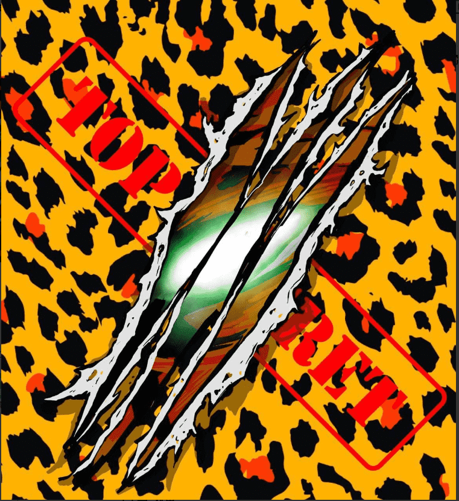

# Stryker NFT Season 1

STROKES NFT Strokes NFT 是一个仅由简单轨迹组成的集合。这是一项仅用几笔就可以生成整个艺术收藏的实验。

这个项目是对最近许多低努力项目如何成为现场大玩家的模仿。整个集合由生活在以太坊区块链中的 3,000 个 NFT 组成，使用数百种不同的特征生成，每个 nft 都是独一无二的。

这将是一个免费的薄荷糖，没有路线图，没有不和谐，社区将由决定成为其中一员的人处理。

STRYKER 已通过以太坊区块链爬入元界，收集了 8,888 个随机生成的 NFT。Stryker NFT 持有者可以参加 NFT AIR DROPS、社区

